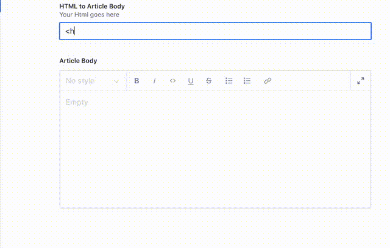

# Sanity Plugin `HTML to Portable Text`

This plugin provides a custom input component which converts `HTML` into [Portable Text](https://github.com/portabletext/portabletext) on the fly.

`Sanity` is using the `Portable Text`-format whenever you use the `block`-type along with the [`WYSIWYG`-Block Content Editor](https://www.sanity.io/docs/customization).

Since `HTML to Portable Text` does a on-the-fly-conversion, it does not mirror nor persist the `HTML` to your schema. This is a deliberate design decision, for one, to avoid redundancy, secondly, to avoid inconsistant data, and thirdly, it would defeat the whole purpose of the `Portable Text`.

You may want to link`HTML to Portable Text` with a `block`-field to persist the corresponding `Portable Text`] to your `schema`.



## Installation

Install the Sanity Plugin `HTML to Portable Text` with the [`sanity CLI`](https://www.sanity.io/docs/cli)

```bash
  sanity install sanity-plugin-html-to-portable-text
```

## Usage/Examples

To make it available, just add a field of `htmlPortableText`-type to your fields-array and reference another field of `block`-type.

```js
fields: [
  {
    name: 'htmlToArticleBody',
    title: 'HTML to Article Body',
    type: 'htmlToProtableText',
    options: { refblock: 'articleBody' },
  {
    name: 'articleBody',
    title: 'Article Body',
    type: 'array',
    of: [ { type: 'block' } ]
  }
]
```

You can configure `styles`, `markers`, `lists`, `decorators`, etc. as you are used to. Only make sure to have it in sync for the `htmlToProtableText`-type as well as the `block`-type.

```js
fields: [
  {
    name: 'htmlToArticleBody',
    title: 'HTML to Article Body',
    type: 'htmlToProtableText',
    options: {
      refblock: 'articleBody',
      styles: [
        // allow only unstyled, H1 and H2
        { title: 'Unstyled', value: 'normal' },
        { title: 'H1', value: 'h1' },
        { title: 'H2', value: 'h2' },
      ]
  },
  {
    name: 'articleBody',
    title: 'Article Body',
    type: 'array',
    of: [
      {
        type: 'block',
        styles: [
          // make sure to sync the same definitions here
          { title: 'Unstyled', value: 'normal' },
          { title: 'H1', value: 'h1' },
          { title: 'H2', value: 'h2' },
        ]
      }
    ]
  }
]
```

### Caveats

- Make sure to have `refblock` reference a **valid** block. Otherwise, sanity will complain about `invalid field`.
- Make sure to set `styles` in options according to `styles` of the refernced block, otherwise conversion back and forth will bear different results.

### Advanced Example

```js
fields: [
  {
    name: 'htmlToArticleBody',
    title: 'HTML to Article Body',
    type: 'htmlToProtableText',
    options: {
      refblock: 'articleBody',
      // Disallow styles
      styles: [],
      // Disallow lists
      lists: [],
      marks: {
        // Only allow these decorators
        decorators: [
            { title: 'Bold', value: 'strong' },
            {
                title: 'Superscript',
                value: 'sup',
                // blockEditor not needed here
            },
        ],
        // disallow links
        annotations: []
      }
  },
  {
    name: 'articleBody',
    title: 'Article Body',
    type: 'array',
    of: [
      {
        type: 'block',
        styles: [],
        lists: [],
        marks: {
          decorators: [
              { title: 'Bold', value: 'strong' },
              {
                  title: 'Superscript',
                  value: 'sup',
                  // Define custom icon and renderer for the blockEditor
                  blockEditor: {
                      icon: () => <div>⤴</div>,
                      render: ({ children }) => <span><sup>{children}</sup></span>
                  }
              },
          ],
          annotations: []
      }
    ]
  }
]
```

## Further reading

- [Introduction to Portable Text](https://www.sanity.io/guides/introduction-to-portable-text).

## Features

- provides a custom input component
- converts `HTML` into [Portable Text](https://github.com/portabletext/portabletext) on the fly
- if linked to a `block`-field, persist the corresponding [Portable Text](https://github.com/portabletext/portabletext) to your `schema`

## Roadmap

- Add `unit tests`, since this is a delicate functionality
- Investigate, if we can introspect the underlying schema so that passing `styles` in options gets obsolete
  - Inspirations to look into:
    - [Content Model Graph](https://www.sanity.io/plugins/content-model-graph)
    - [Schema Inspector](https://www.sanity.io/plugins/schema-inspector)
- If schema-introspection is possible, check if `refblock` references an existing `block`-type field
